|                                                              |                                                              |
| :----------------------------------------------------------: | :----------------------------------------------------------: |
|  ***Figure 1: Inner Router Weight Distribution on EuroSat (Task 1)*** | 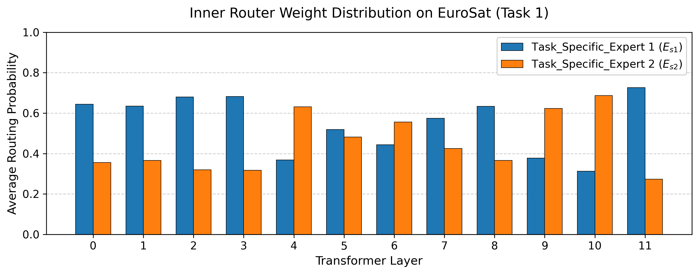 ***Figure 2: Inner Router Weight Distribution on EuroSat (Task 2)*** |
| 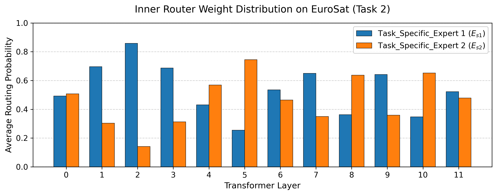 ***Figure 3: Inner Router Weight Distribution on EuroSat (Task 3)*** | 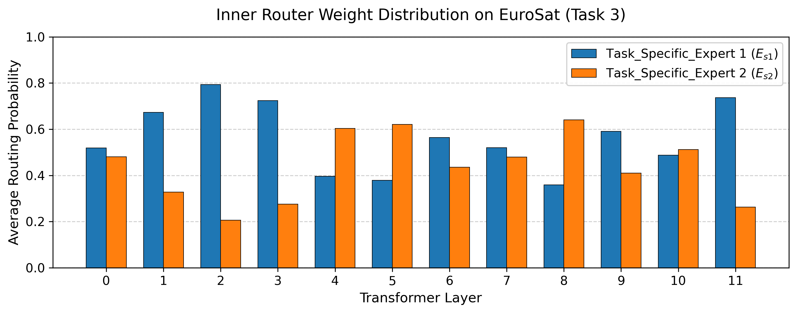 ***Figure 4: Inner Router Weight Distribution on EuroSat (Task 4)*** *(Note: Task 5 is available in `./figure/router_inner_eurosat/`)* |
| 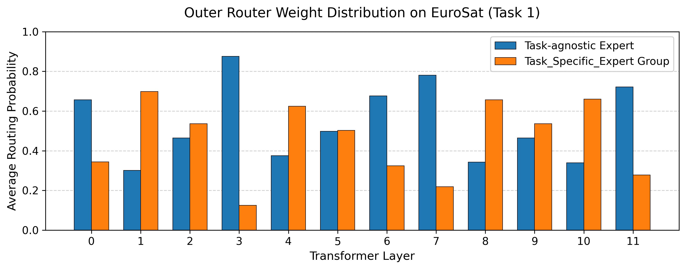 ***Figure 5: Outer Router Weight Distribution on EuroSat (Task 1)*** |  ***Figure 6: Outer Router Weight Distribution on EuroSat (Task 2)*** |
|  ***Figure 7: Outer Router Weight Distribution on EuroSat (Task 3)*** |  ***Figure 8: Outer Router Weight Distribution on EuroSat (Task 4)*** *(Note: Task 5 is available in `./figure/router_outer_eurosat/`)* |
| 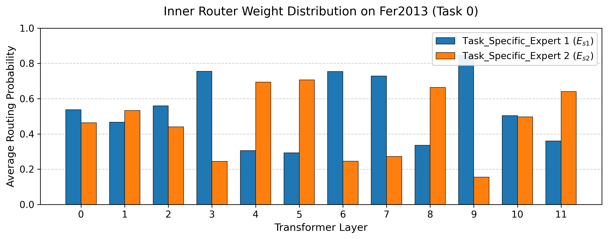 ***Figure 9: Inner Router Weight Distribution on FER2013 (Task 1)*** | 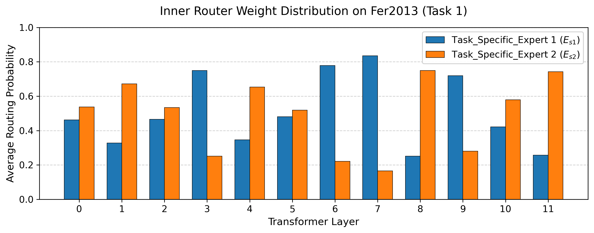 ***Figure 10: Inner Router Weight Distribution on FER2013 (Task 2)*** |
| 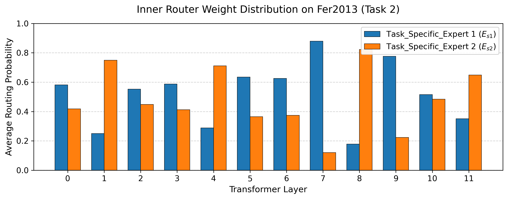 ***Figure 11: Inner Router Weight Distribution on FER2013 (Task 3)*** | 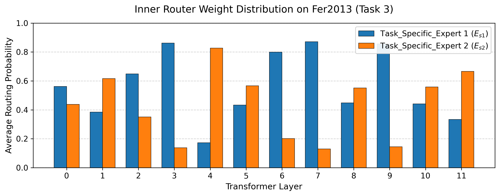 ***Figure 12: Inner Router Weight Distribution on FER2013 (Task 4)*** |
| 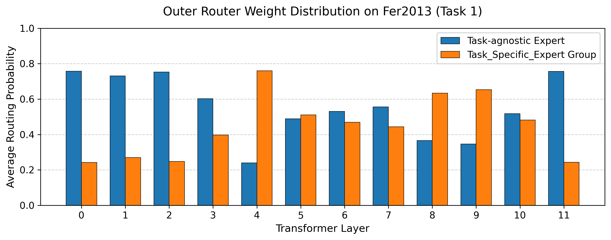 ***Figure 13: Outer Router Weight Distribution on FER2013 (Task 1)*** | 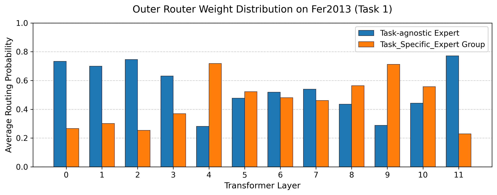 ***Figure 14: Outer Router Weight Distribution on FER2013 (Task 2)*** |
|  ***Figure 15: Outer Router Weight Distribution on FER2013 (Task 3)*** | 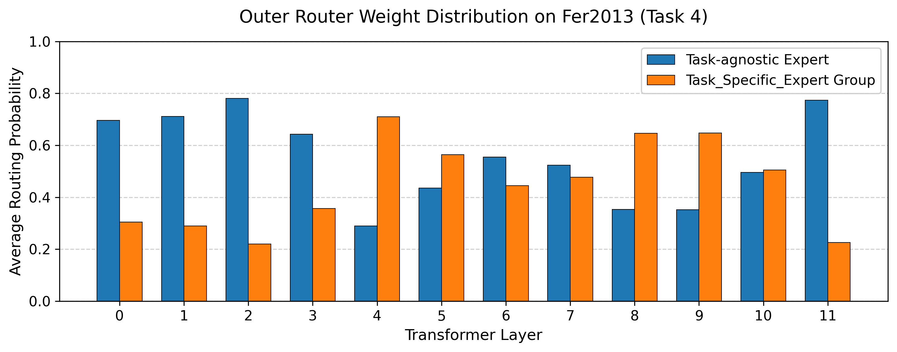 ***Figure 16: Outer Router Weight Distribution on FER2013 (Task 4)*** |
| 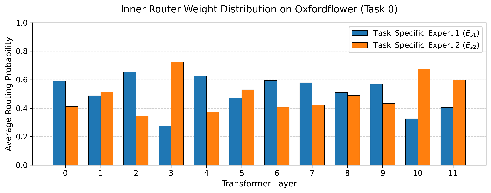 ***Figure 17: Inner Router Weight Distribution on Flower (Task 1)*** | 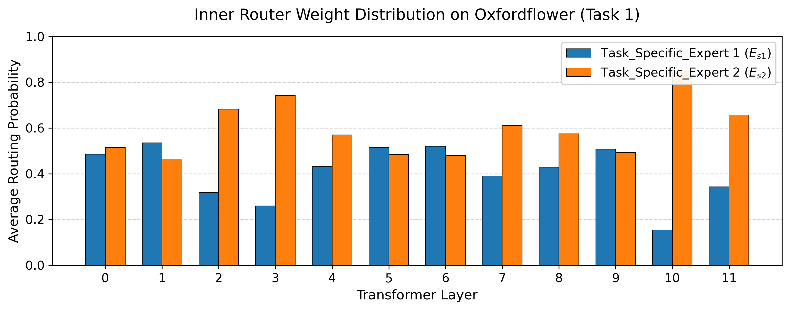 ***Figure 18: Inner Router Weight Distribution on Flower (Task 2)*** |
| 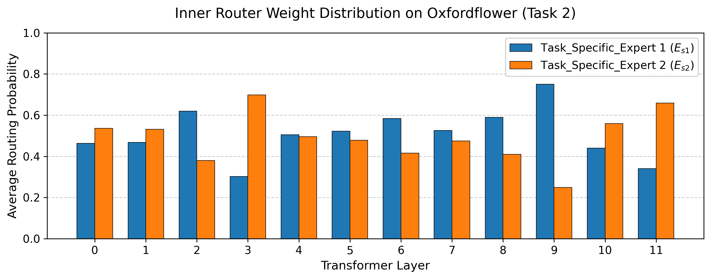 ***Figure 19: Inner Router Weight Distribution on Flower (Task 3)*** | 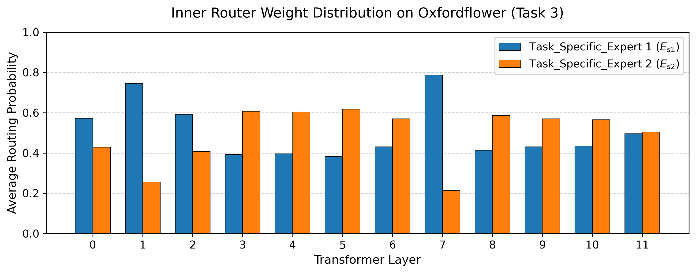 ***Figure 20: Inner Router Weight Distribution on Flower (Task 4)*** *(Note: Tasks 5-17 are available in `./figure/router_inner_flower/`)* |
| 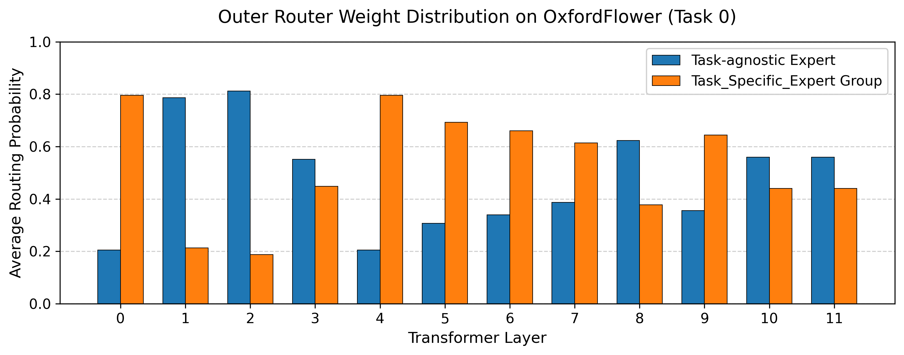 ***Figure 21: Outer Router Weight Distribution on Flower (Task 1)*** | 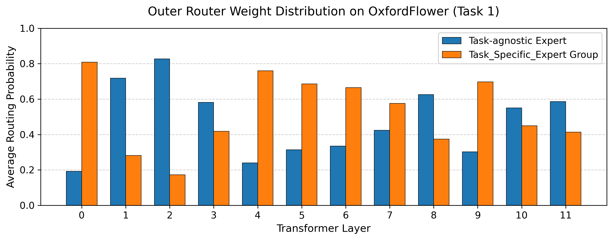 ***Figure 22: Outer Router Weight Distribution on Flower (Task 2)*** |
| 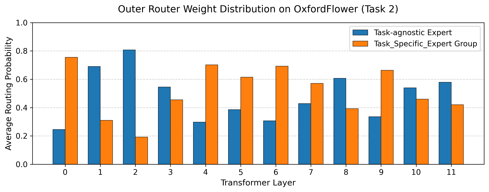 ***Figure 23: Outer Router Weight Distribution on Flower (Task 3)*** | 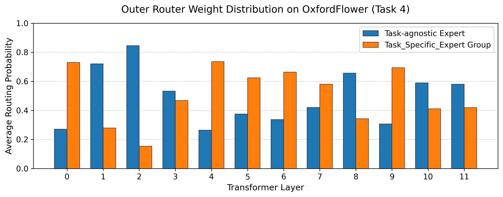 ***Figure 24: Outer Router Weight Distribution on Flower (Task 4)*** *(Note: Tasks 5-17 are available in `./figure/router_outer_flower/`)* |

